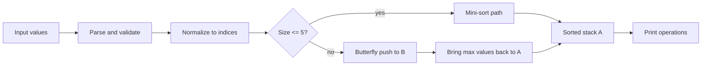

<div align="center">

# push_swap

### A tiny stack-sorting machine with a fast butterfly heart

<p>
  
  
  
  
</p>

<p>
  <strong>Two stacks.</strong>
  <strong>Eleven operations.</strong>
  <strong>One clean mission:</strong>
  sort integers in ascending order using as few moves as possible.
</p>

<p>
  This repository contains both the mandatory <code>push_swap</code> program and the bonus
  <code>checker</code>, built in C as part of the 42 curriculum.
</p>

</div>

---

## Why this repo feels alive

- Small inputs get dedicated hand-tuned sorts for 2, 3, 4, and 5 numbers.
- Large inputs use a butterfly-style strategy that pushes smartly to stack B and rebuilds A in order.
- Values are normalized to indices first, so the algorithm works with position logic instead of raw numbers.
- Parsing is strict: invalid numbers, duplicates, overflow, and empty input are rejected with `Error`.
- The bonus checker replays instructions from `stdin` and validates the final stack state.

> If `push_swap` is a game of pressure, this version tries to stay graceful: parse early, move with purpose, and keep the stack logic readable.

---

## At a glance

| Part | What it does |
|------|---------------|
| `push_swap` | Sorts integers and prints the operations needed to do it |
| `checker` | Reads operations from `stdin` and checks whether they sort the input correctly |
| Small sort path | Handles 2 to 5 values with compact dedicated logic |
| Butterfly path | Handles larger inputs with chunk-based push/rebuild behavior |
| Validation layer | Rejects malformed input before sorting begins |

---

## Quick start

```bash
# Build push_swap
make

# Build the bonus checker
make bonus

# Try a tiny case
./push_swap 3 2 1

# Try a quoted string
./push_swap "5 1 4 2 3"

# Verify with checker
ARG="4 67 3 87 23"
./push_swap $ARG | ./checker $ARG
```

### Make targets

| Command | Result |
|---------|--------|
| `make` | Build `push_swap` |
| `make bonus` | Build `checker` |
| `make clean` | Remove object files |
| `make fclean` | Remove object files and binaries |
| `make re` | Rebuild from scratch |

---

## How it works



### Mini-sort path

For very small stacks, the program avoids overthinking:

- `2` values: one conditional `sa`
- `3` values: compare indexed positions and apply the shortest matching pattern
- `4` values: rotate the minimum to the top, `pb`, sort the remaining three, then `pa`
- `5` values: same idea, but one level deeper

### Butterfly path

For larger stacks, the program switches to a butterfly-style flow:

1. Convert every value into its sorted index.
2. Walk through stack A with a moving `next_index` and a fixed chunk size.
3. Push low indices to B immediately.
4. Rotate some of them inside B so the rebuild phase becomes cheaper.
5. Repeatedly bring the highest index in B to the top and `pa` it back to A.

This implementation uses these chunk sizes:

| Input size | Chunk size |
|------------|------------|
| `<= 10` | `2` |
| `<= 100` | `15` |
| `<= 500` | `32` |
| `> 500` | `45` |

---

## The 11 allowed operations

<details>
<summary><strong>Open operation list</strong></summary>

| Operation | Effect |
|-----------|--------|
| `sa` | Swap the top 2 elements of stack A |
| `sb` | Swap the top 2 elements of stack B |
| `ss` | `sa` and `sb` at the same time |
| `pa` | Push the top of B onto A |
| `pb` | Push the top of A onto B |
| `ra` | Rotate A upward |
| `rb` | Rotate B upward |
| `rr` | `ra` and `rb` at the same time |
| `rra` | Reverse rotate A |
| `rrb` | Reverse rotate B |
| `rrr` | `rra` and `rrb` at the same time |

</details>

---

## Input rules

The program accepts both split arguments and a single quoted string:

```bash
./push_swap 5 4 3 2 1
./push_swap "5 4 3 2 1"
```

It prints `Error` to `stderr` when input is invalid, including:

- non-numeric arguments
- duplicate values
- values outside the `int` range
- empty strings or whitespace-only input

---

## Bonus checker

The bonus program reads operation names line by line from `stdin`, applies them to the input stack, and prints:

- `OK` if stack A ends sorted and stack B is empty
- `KO` if the operations finish in the wrong state
- `Error` for invalid instructions or invalid arguments

```bash
# Correct sequence
./push_swap 2 1 3 | ./checker 2 1 3

# Invalid instruction
echo "spin" | ./checker 2 1 3
```

---

## Extra docs

- [Defense guide](DEFENSE.md)
- [Mermaid structure file](pushswap_structure.mermaid)

---

## Project map

<details>
<summary><strong>Open file structure</strong></summary>

```text
.
|-- Makefile
|-- README.md
|-- push_swap.h
|-- push_swap_bonus.h
|
|-- main.c
|-- parsing.c
|-- parsing_bonus.c
|-- utils.c
|-- utils_bonus.c
|-- ft_split.c
|-- ft_split_bonus.c
|-- indexing.c
|-- indexing_bonus.c
|
|-- stack_create.c
|-- stack_create_bonus.c
|-- stack_utils.c
|-- stack_utils_bonus.c
|
|-- operations.c
|-- operations_bonus.c
|-- operations_push.c
|-- operations_push_bonus.c
|-- rotate.c
|-- rotate_bonus.c
|-- reverse_rotate.c
|-- reverse_rotate_bonus.c
|
|-- small_sort.c
|-- small_sort_utils.c
|
|-- butterfly.c
|-- butterfly_utils.c
|-- butterfly_back.c
|
|-- checker_bonus.c
|-- checker_read_bonus.c
`-- checker_exec_bonus.c
```

</details>

---

## Final note

This repo was built to be clean enough to study, small enough to navigate, and sharp enough to score full marks in the 42 project.

If you like low-level logic, tiny optimizations, and stack choreography, this is the fun kind of C project.
