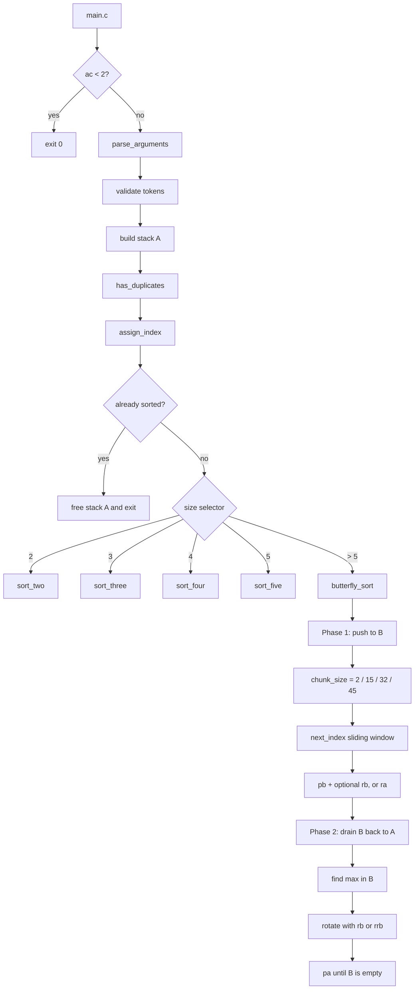
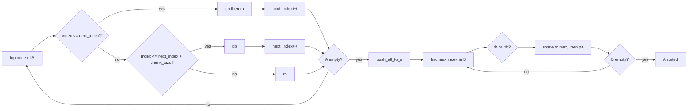
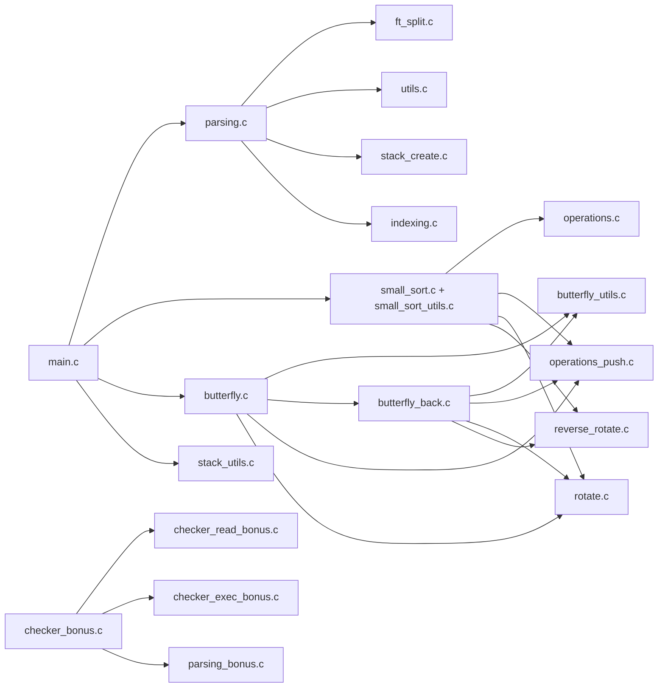
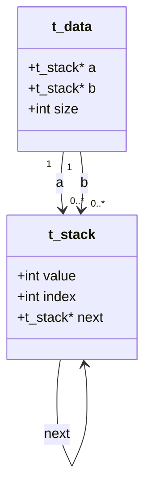
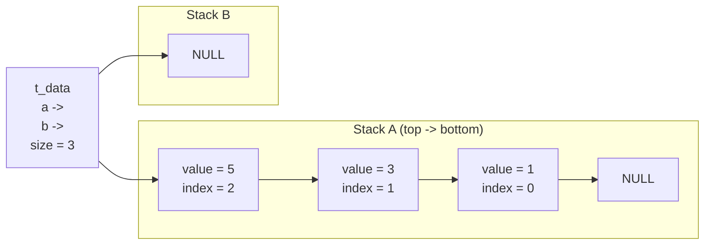
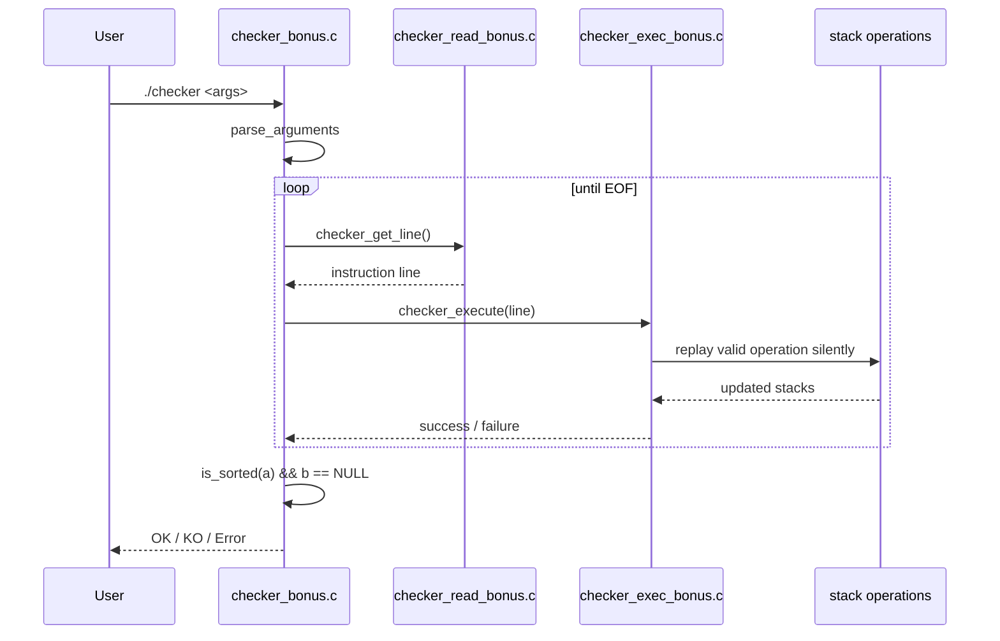

# push_swap Structure Diagrams

This page collects the rendered Mermaid diagrams for the repository so GitHub can preview the project flow directly.

---

## 1. Mandatory flow

---

## 2. Butterfly detail

---

## 3. File and module map

---

## 4. Data structures

### Stack memory example

---

## 5. Bonus checker flow

---

## 6. Complexity reference

| Area | Practical complexity | Why |
|------|----------------------|-----|
| Parsing | O(n^2) | Duplicate detection compares pairs |
| Indexing | O(n^2) | `assign_index` repeatedly scans for the next minimum |
| Small sorts | O(1) | Fixed-size cases with dedicated logic |
| Butterfly phase 1 | O(n^2) practical | Rotations and repeated window checks on linked lists |
| Butterfly phase 2 | O(n^2) practical | Repeated max search plus `rb`/`rrb` rotations |
| `push` / `swap` | O(1) | Head-node rewiring |
| `rotate` / `reverse rotate` | O(n) | Tail or pre-tail traversal is required |
